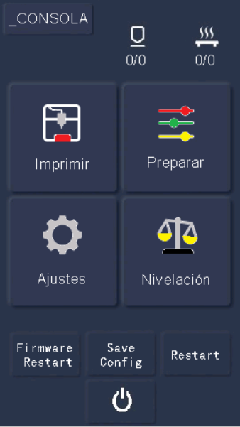
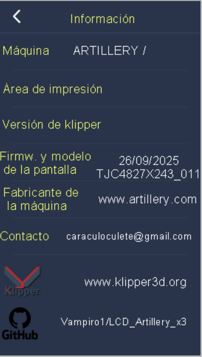
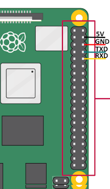
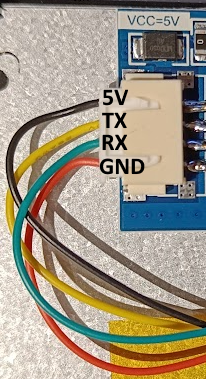
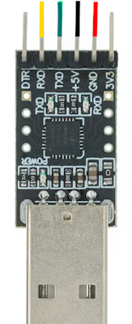
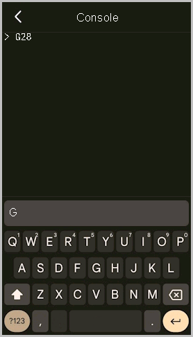
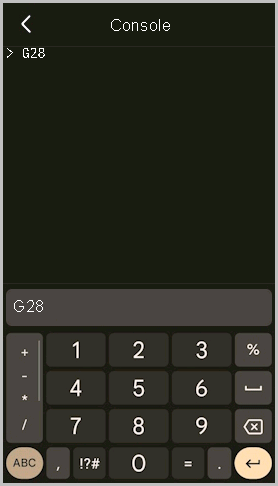
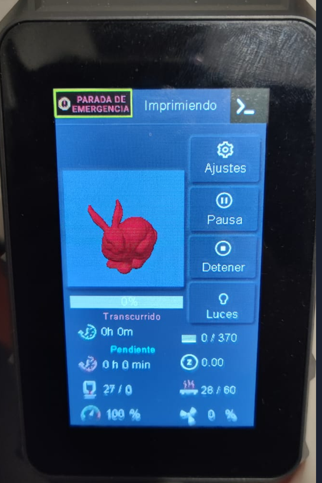

# KlipperLCD (for Artillery X3 plus/Pro LCD screen)
Want to run Klipper on your Artillery x3 Plus/Pro? And still want to be able to use your Artillery x3 Plus/Pro LCD touch screen?

# .[GHITHUB]..       (https://github.com/Vampiro1/LCD_Artillery_x3).

Take a look at this python service for the Elegoo Neptune 3 Pro LCD! Running together with Klipper3d and Moonraker!

## Look and feel
<p float="left">
    
    
    
</p>

## Whats needed?
* A Artillery x3 Plus/Pro with LCD screen.
* A Raspberry Pi or similar SBC to run Klipper. I suggest using the [Klipper Installation And Update Helper (KIAUH)](https://github.com/dw-0/kiauh) to setup and install Klipper, Moonraker and the web user interface of choice ([Fluidd](https://docs.fluidd.xyz/)/[Mainsail](https://docs.mainsail.xyz/)).
* Some re-wiring of the LCD screen to connect it to one of the UARTs availible on your Raspberry Pi / SBC or through a USB to UART converter.
* Then you can follow this guide to enable your Neptune 3 Pro touch screen!

## Wire the LCD
When wiring your screen, you can either wire it directly to one of your Raspberry Pi / SBC availible UARTs or you can wire it through a USB to UART converter. Both options are described below, pick the option that suits your needs.

### To a Raspberry Pi UART
1. Remove the back-cover of the LCD by unscrewing the four screws.

2. Connect the LCD to the Raspberry Pi UART according to the table below:

    | Raspberry Pi  | LCD               |
    | ------------- | ----------------- |
    | Pin 4 (5V)    | 5V  (Black wire)  |
    | Pin 6 (GND)   | GND (Red wire)    |
    | GPIO 14 (TXD) | RX  (Green wire)  |
    | GPIO 15 (RXD) | TX (Yellow wire)  |

    <p float="left">
        
        
    </p>

### USB to UART Converter
Quite simple, just remember to cross RX and TX on the LCD and the USB/UART HW.
| USB <-> UART HW | LCD               |
| --------------- | ----------------- |
| 5V              | 5V  (Black wire)  |
| GND             | GND (Red wire)    |
| TXD             | RX  (Green wire)  |
| RXD             | TX (Yellow wire)  |

<p float="left">
    
    
</p>

## Update the LCD screen firmware
1. Copy the LCD screen firmware `Firm_Update/141025.tft` to the root of a FAT32 formatted micro-SD card.
2. Make sure the LCD screen is powered off.
3. Insert the micro-SD card into the LCD screens SD card holder. Back-cover needs to be removed.
4. Power on the LCD screen and wait for screen to say `Update Successed!`

## Enable the UART
> **_Note_**: You can safely skip this section if you wired the display through a USB to UART converter
### [Disable Linux serial console](https://www.raspberrypi.org/documentation/configuration/uart.md)
  By default, the primary UART is assigned to the Linux console. If you wish to use the primary UART for other purposes, you must reconfigure Raspberry Pi OS. This can be done by using raspi-config:

  * Start raspi-config: `sudo raspi-config.`
  * Select option 3 - Interface Options.
  * Select option P6 - Serial Port.
  * At the prompt Would you like a login shell to be accessible over serial? answer 'No'
  * At the prompt Would you like the serial port hardware to be enabled? answer 'Yes'
  * Exit raspi-config and reboot the Pi for changes to take effect.
  
  For full instructions on how to use Device Tree overlays see [this page](https://www.raspberrypi.org/documentation/configuration/device-tree.md). 
  
  In brief, add a line to the `/boot/config.txt` file to apply a Device Tree overlay.
    
    dtoverlay=disable-bt

## Run the KlipperLCD service
* SSH into your Raspberry Pi

### Klipper socket API
* Make sure Klipper's API socket is enabled by reading the Klipper arguments.

    Command:

        cat ~/printer_data/systemd/klipper.env

    Response:

        KLIPPER_ARGS="/home/pi/klipper/klippy/klippy.py /home/pi/printer_data/config/printer.cfg -I /home/pi/printer_data/comms/klippy.serial -l /home/pi/printer_data/logs/klippy.log -a /home/pi/printer_data/comms/klippy.sock"
    
    The KLIPPER_ARGS should include `-a /home/pi/printer_data/comms/klippy.sock`. If not add it to the klipper.env file!

### Install dependencies
    sudo apt-get install python3-pip git
    pip install pyserial

### Get the code
    git clone https://github.com/Vampiro1/LCD_Artillery_x3 KlipperLCD
    cd KlipperLCD

### Configure the code
* Open `main.py` and find the `class KlipperLCD` declaration:
```python
class KlipperLCD ():
    def __init__(self):
        ...
        LCD("/dev/ttyAMA0", callback=self.lcd_callback)
        ...
        PrinterData('XXXXXX', URL=("127.0.0.1"), klippy_sock='/home/pi/printer_data/comms/klippy.sock')
```
* If your UART is something other than the default `ttyAMA0`, replace the string `"/dev/ttyAMA0"` to match your UART selection. 


    > **_Note_**: If using a USB to UART converter to connect your screen to Klipper, the converter usually shows up in Linux as `"/dev/ttyUSB0"`.


* Or if your Klipper socket is called something else, replace `klippy_sock` string `"/home/pi/printer_data/comms/klippy.sock"` with the path and name of your klipper socket file.

### Run KlipperLCD service at boot
If the path of `main.py` is something else than `/home/pi/KlipperLCD/main.py` or your user is not `pi`. Open and edit `KlipperLCD.service` to fit your needs.

Enable the service to automatically start at boot:

        cd /home/pi/KlipperLCD
        
        ln -sf /home/pi/KlipperLCD/firmware/141025usado.tft LCD.tft
        
        chmod +x main.py firmw_update.py firmw.py KlipperLCD.service
        sudo cp KlipperLCD.service /etc/systemd/system/KlipperLCD.service
        sudo chmod 644 /etc/systemd/system/KlipperLCD.service
        sudo systemctl daemon-reload
        sudo systemctl enable KlipperLCD.service
        sudo systemctl start KlipperLCD.service
        
        MOONRAKER_ASVC=/home/pi/printer_data/moonraker.asvc
        grep -qxF "KlipperLCD" $MOONRAKER_ASVC || echo "KlipperLCD" | sudo tee -a $MOONRAKER_ASVC > /dev/null
        
        CONF=/home/pi/printer_data/moonraker.conf
        grep -q "\[update_manager KlipperLCD\]" $CONF || sudo tee -a $CONF > /dev/null <<EOL
        [update_manager KlipperLCD]
        type: git_repo
        path: ~/KlipperLCD
        origin: https://github.com/Vampiro1/LCD_Artillery_x3.git
        branch: main
        is_system_service: True
        EOL
        
        sudo systemctl restart moonraker

## Console
The console is enabled by default and can be accessed by clicking center top of the main screen or by clicking the thumbnail area while printing.

The console enables sending commands and will display all gcode responses and information from Klipper normally found in the console tab in Mainsail or Fluidd.

<p float="left">
    
    
    
</p>

## Thumbnails
KlipperLCD also supports thumbnails!
set the laminator to 300x300

Follow this guide to enable thumbnails in your slicer: https://klipperscreen.readthedocs.io/en/latest/Thumbnails/

<p float="left">
    
    
</p>
